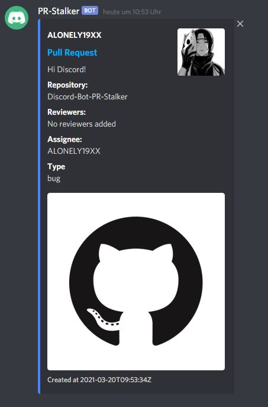
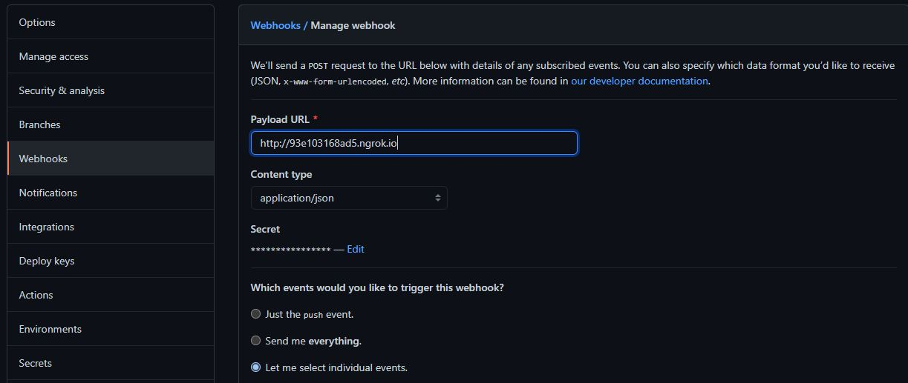

# PR-Stalker
**P**ull **R**equest **Stalker** is a Discord Bot, which tracks your git repository and notifies your Discord channel by sending embed messages.

### Preview
---
This is how the message will look that gets posted by PR-Stalker:

  
### Prerequisite
---
I assume that you already created a Discord bot, added it to your Discord channel and generated a bot token.

### Configuration
---


**In your GitHub repo that you want to track:**
- Set `Payload URL` (URL of your PR-Stalker application)
  - If you want to run PR-Stalker locally, you can check out [ngrok](https://ngrok.com/)
- Set `Content type` to `application/json`
- Set `Secret` (remember it!)
- Set `Which events would you like to trigger this webhook?` to `Let me select individual events` and then select the event `Pull requests`
  
**In the root of this cloned repo:**  
Create a file called `config.json` which looks like this:
```
{
  "discord": {
    "BOT_TOKEN": "<DISCORD-BOT-TOKEN>",
    "CHANNEL_ID": "<CHANNEL-ID-OF-DISCORD_CHANNEL>"
  },
  "github": {
    "GITHUB_REPO_OWNER": "<GITHUB-REPO-OWNER-USERNAME>",
    "GITHUB_REPO_NAME": "<GITHUB-REPO-NAME>",
    "WEBHOOK_SECRET": "<YOUR-SET-WEBHOOK-SECRET-FROM-ABOVE>"
  }
}
```
### Run
--- 
To run the bot, run the following command:
```
node index.js
```
